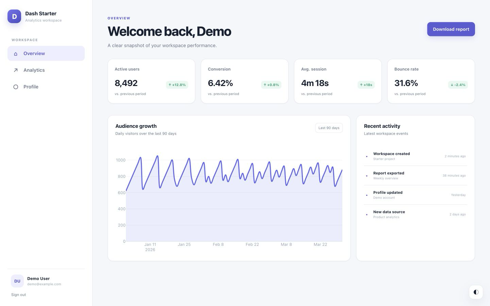
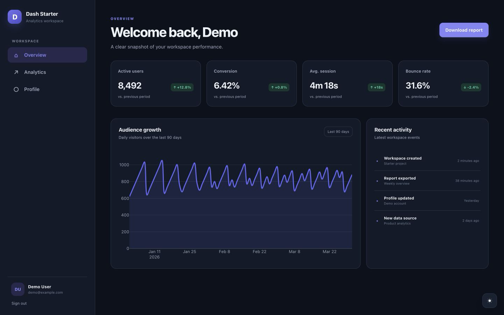
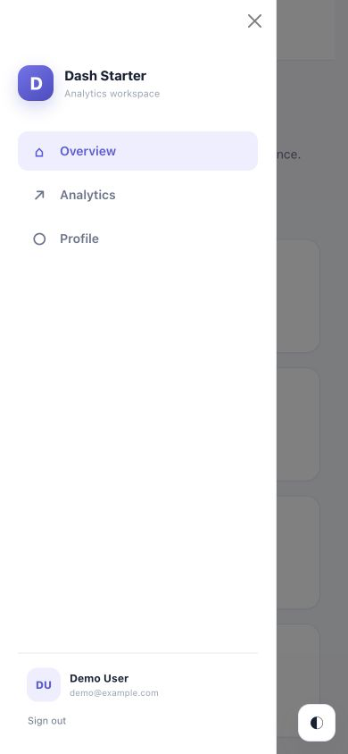

# Dash + Flask authentication starter

[](https://github.com/nekrasovp/dash-auth-flask-nginx/actions/workflows/ci.yml)
[](https://www.python.org/)
[](LICENSE)

A production-minded, responsive starter for authenticated [Dash](https://dash.plotly.com/) applications. It combines Dash Pages, Flask-Login, Flask-SQLAlchemy, SQLite, Docker Compose, Gunicorn, and Nginx without hiding the important pieces behind a large framework.



## What is included

- Responsive overview and analytics pages with light and dark themes
- Registration, login, logout, profile editing, and secure password reset
- Single-use, hashed, 30-minute reset tokens
- Flask-SQLAlchemy models using SQLAlchemy 2 style sessions
- Mailjet delivery in production and console delivery during development
- Persistent SQLite storage, health checks, Gunicorn, and Nginx
- Pytest, Dash browser tests, Ruff, and GitHub Actions
- Agent-ready repository guidance, path-specific instructions, templates, and repeatable Make targets

## Quick start with Docker

Copy the example environment and start the stack:

```bash
cp .env.example .env
docker compose up --build
```

Open <http://localhost:8000>. Registration is enabled, so you can create an account immediately.

To opt into the documented development account, set `SEED_DEMO_USER=true` in `.env` before starting. Its default credentials are `demo@example.com` / `dash-demo-password`. Demo seeding is rejected in production.

Stop the stack with:

```bash
docker compose down
```

The `app-data` named volume preserves SQLite data. Add `--volumes` only when you intentionally want a clean database.

## Development

The root `Makefile` is the canonical interface for both contributors and coding agents:

```bash
make setup
make check
```

`make setup` creates `.env` when needed, builds a Python 3.13 virtual environment, and installs development dependencies. `make check` runs Ruff, the non-browser tests, and both Compose configuration validations. Run `make test-browser` when changing UI, callbacks, routing, or authentication.

The development override bind-mounts the source and enables Dash hot reload:

```bash
make dev
```

The Nginx path remains <http://localhost:8000>; the application is also available directly at <http://localhost:8050> for debugging.

The equivalent local Python workflow is:

```bash
cd dash-auth-flask
python3.13 -m venv .venv
source .venv/bin/activate
python -m pip install -r requirements-dev.txt
export APP_ENV=development
export DATABASE_URL=sqlite:///users.db
flask --app app:server init-db
python app.py
```

Run the checks:

```bash
make lint
make test
make test-browser
```

Browser tests require a local Chrome or Chromium installation.

## Configuration

| Variable | Default | Purpose |
| --- | --- | --- |
| `APP_ENV` | `development` | `development`, `test`, or `production` |
| `SECRET_KEY` | ephemeral in development | Flask session signing key; required in production |
| `DATABASE_URL` | local SQLite file | SQLAlchemy connection URL |
| `MAIL_BACKEND` | `console` | `console` locally or `mailjet` in production |
| `MAILJET_API_KEY` | empty | Mailjet API key |
| `MAILJET_API_SECRET` | empty | Mailjet API secret |
| `MAIL_FROM` | `no-reply@example.com` | Password-reset sender |
| `RESET_TOKEN_TTL_MINUTES` | `30` | Positive reset-link lifetime |
| `SEED_DEMO_USER` | `false` | Enables the development-only demo seed command |
| `DEMO_USER_*` | documented in `.env.example` | Optional demo account details |

`APP_ENV=production` refuses to start without a secret key, Mailjet backend, and Mailjet credentials. Store production secrets in your deployment platform or Docker secrets rather than committing `.env`.

## Architecture

```text
Browser → Nginx :8000 → Gunicorn → Dash / Flask
                                      ├── Flask-Login sessions
                                      ├── SQLAlchemy → SQLite volume
                                      └── Console or Mailjet email
```

Dash Pages owns browser routing. Public pages are `/login`, `/register`, `/forgot-password`, and `/reset-password`; `/`, `/analytics`, and `/profile` require authentication. `/home`, `/page1`, `/forgot`, and `/change` remain as compatibility redirects. `GET /healthz` verifies database access.

The starter intentionally keeps SQLite and `db.create_all()` approachable. Before using it for a high-traffic or security-sensitive service, consider PostgreSQL, Alembic migrations, external rate limiting, server-side sessions, centralized secrets, HTTPS enforcement, and production observability.

## Repository workflow

The project is prepared for human and agent-driven contribution:

- [AGENTS.md](AGENTS.md) is the source of truth for architecture boundaries, security invariants, and validation requirements.
- [CONTRIBUTING.md](CONTRIBUTING.md) documents branches, pull requests, labels, and review readiness.
- `.github/copilot-instructions.md` and `.github/instructions/` provide GitHub Copilot with repository-wide and path-specific context.
- Pull request and issue forms require impact, security, reproduction, and validation details.
- Dependabot tracks Python, Docker, Nginx, and GitHub Actions dependencies.
- CI runs lint/format checks, unit and integration tests, browser smoke tests, Compose validation, and multi-architecture image builds.

Start branches from `main`, keep changes focused, and open pull requests as drafts until CI and any required visual verification are complete. See [SECURITY.md](SECURITY.md) for private vulnerability reporting.

## More views

| Dark dashboard | Mobile navigation |
| --- | --- |
|  |  |
